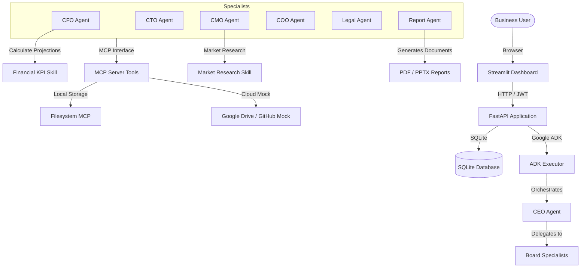

# BoardRoom AI

> **"The AI Executive Board That Thinks Before Your Business Acts."**

BoardRoom AI is a production-quality, enterprise-grade AI Multi-Agent system built with the Google Agent Development Kit (ADK) designed for strategic business decision vetting. Instead of relying on a single AI chatbot, BoardRoom AI deploys a structured board of specialized agents (CEO, CFO, CTO, CMO, COO, and Legal) who debate proposals, perform calculations, run risk matrices, research competitors, and compile vetted strategy reports.

This project is prepared and packaged as a **Kaggle AI Agents Capstone Project Showcase**.

---

## Architecture Overview

### Component Diagram



### Sequence Flow Diagram

```mermaid
sequence_order
actor User
participant Dashboard as Streamlit Dashboard
participant API as FastAPI Backend
participant CEO as CEO Orchestrator
participant Specialists as Specialist Agents
participant DB as SQLite DB

User->>Dashboard: Submit business proposal (Upload files)
Dashboard->>API: POST /api/board/start
API->>DB: Create session (status: running)
API-->>Dashboard: Return Session ID (Background processing starts)
loop Board Vetting Debate
    CEO->>Specialists: Delegate sub-tasks (CTO, CFO, CMO, COO, Legal)
    Specialists->>DB: Write logs & Dialogue updates
    Specialists-->>CEO: Submit executive reports
end
CEO->>API: Resolve debate and compile final score
API->>API: Generate PDF, PPTX & Markdown strategy report files
API->>DB: Complete session (status: completed)
User->>Dashboard: Check Session Logs & Download Report Packages
```

---

## Folder Structure

```
boardroom-ai/
+-- .github/
|   +-- workflows/
|       +-- ci.yml             # Github Actions CI/CD Pipeline
+-- backend/
|   +-- app/
|   |   +-- __init__.py
|   |   +-- agent.py          # CEO Orchestrator & Specialist Agent definitions
|   |   +-- config.py         # Static uploads and paths configuration
|   |   +-- skills.py         # Reusable Skills (Market Research, Financial, Visualization)
|   |   +-- tools.py          # Filesystem, DB, Browser MCP tools and Sensitive Action Approval
|   +-- api/
|   |   +-- __init__.py
|   |   +-- routes.py         # FastAPI REST Router (Auth, Session run, Approvals, Memory)
|   +-- database/
|   |   +-- __init__.py
|   |   +-- models.py         # SQLAlchemy Database models (Users, Message history, logs)
|   +-- memory/
|   |   +-- __init__.py
|   |   +-- store.py          # SQLite Memory bank keyword retrieval & audit logger
|   +-- security/
|   |   +-- __init__.py
|   |   +-- auth.py           # JWT Authentication, Password Hashing, RBAC, Prompt injection detector
|   +-- utils/
|   |   +-- __init__.py
|   |   +-- parser.py         # Document Parser (PDF, DOCX, CSV, Excel, TXT)
|   |   +-- reports.py        # Report compiler (ReportLab PDF & python-pptx PPTX)
|   +-- main.py               # FastAPI entrypoint
+-- frontend/
|   +-- components/
|   |   +-- styles.py         # Custom CSS (Glassmorphism UI layout)
|   +-- pages/
|   |   +-- auth.py           # Streamlit Sign In / Sign Up Forms
|   |   +-- dashboard.py      # Premium Streamlit dashboard pages
|   |   +-- landing.py        # Interactive landing page
|   +-- app.py                # Streamlit entrypoint
+-- tests/
|   +-- test_auth.py          # Security and Auth tests
|   +-- test_reports.py       # Report compiler tests
+-- Dockerfile                # Backend Docker containerization
+-- Dockerfile.frontend       # Streamlit Docker containerization
+-- docker-compose.yml        # Multi-service docker orchestration
+-- requirements.txt          # Python dependencies
+-- .env.example              # Template environment config
+-- README.md                 # Primary documentation
```

---

## Installation & Setup

### Prerequisites
* Python 3.11+
* `uv` (recommended) or standard `pip`

### Step 1: Clone and Configure Environment
1. Clone this repository to your local workspace.
2. Copy `.env.example` to `.env`:
   ```bash
   cp .env.example .env
   ```
3. Open `.env` and fill in your `GEMINI_API_KEY` (obtained for free from [Google AI Studio](https://aistudio.google.com/)).

### Step 2: Set up Virtual Environment & Install Dependencies
Using `uv` for fast installation:
```bash
uv venv
source .venv/bin/activate  # On Windows: .venv\Scripts\activate
uv pip install -r requirements.txt
uv pip install pypdf
```

---

## Running the Application

### Option A: Running Locally with Script
On Windows, you can launch the entire application (Backend + Frontend) with:
```bash
run_local.bat
```
Alternatively, manually start each service:
1. **Start FastAPI Backend**:
   ```bash
   python -m uvicorn backend.main:app --host 0.0.0.0 --port 8000 --reload
   ```
2. **Start Streamlit Frontend**:
   ```bash
   streamlit run frontend/app.py --server.port 8501
   ```

### Option B: Running with Docker Compose
To run in containerized production mode:
```bash
docker-compose up --build
```
Access the dashboard at `http://localhost:8501`.

---

## API Documentation

### Authentication
* **POST `/api/auth/register`**: Creates new user with Role-Based Access Control (`viewer`, `manager`, `admin`).
* **POST `/api/auth/login`**: Returns JWT access token.

### BoardRoom Operations
* **POST `/api/board/start`**: Initiates a background boardroom run with a project proposal.
* **GET `/api/board/sessions`**: Lists all past sessions and their current execution status.
* **GET `/api/board/session/{session_id}/timeline`**: Fetches the logs and step timeline for a session.
* **GET `/api/board/session/{session_id}/messages`**: Streams the dialog transcripts of agent debates.

### File Processing & Approvals
* **POST `/api/board/upload`**: Uploads and parses context files (PDF, DOCX, CSV, Excel, TXT).
* **GET `/api/board/approvals`**: Lists pending high-risk tool operations.
* **POST `/api/board/approve/{approval_id}`**: Approves or rejects a sensitive action (Manager/Admin only).

### Reports & Memory
* **GET `/api/reports/download/{session_id}/{format}`**: Downloads Markdown, ReportLab PDF, or Slide PPTX files.
* **GET `/api/memory/search`**: Searches memory bank using text similarity.

---

## Competition Capstone Demo Assets

### 5-Minute Demo Script
1. **Introduction (1 min)**: Show the BoardRoom AI landing page. Explain the concept of multi-agent debate using Google ADK to eliminate LLM single-perspective bias.
2. **Board Vetting (2 mins)**: Enter the dashboard. Log in as `admin`. Submit a business proposal (e.g., "Launch a green retail delivery SaaS in Munich"). Attach a reference spreadsheet. Click "Initiate Board Debate".
3. **Live Debate Review (1 min)**: Show the Live Timeline updating and show the agent bubbles of CEO routing, CFO analyzing ROI, CTO evaluating the Python/Postgres stack, and Legal pointing out GDPR regulatory compliance.
4. **Outcome Presentation (1 min)**: View the generated ROI chart, download the completed ReportLab PDF and PowerPoint deck, and show the Security Audit log confirming the operations.

### Presentation Outline
* **Slide 1**: Title, Subtitle, Team, Objective.
* **Slide 2**: The Challenge: Single AI agent bias. The Solution: Structured Google ADK board debate.
* **Slide 3**: Architecture & Security (JWT, RBAC, Prompt Injection Protection, SQLite).
* **Slide 4**: Agent Roles, Custom Skills (Financial, SWOT, PDF generation).
* **Slide 5**: Demo video/Screenshots and Future expansions.

---

## Troubleshooting & FAQ

* **Issue: "ModuleNotFoundError: No module named 'google.adk'"**
  Ensure the virtual environment is activated and `requirements.txt` has been fully installed using `uv pip install`.
* **Issue: "Unauthorized" or "Invalid Token"**
  Ensure the Bearer Authorization header is correctly sent or reset your session state in Streamlit.
* **Issue: "Rate Limit Exceeded"**
  If using a free tier Gemini API key, ensure you are spacing out session runs by at least 30-60 seconds.

---

## License & Contributions
This project is licensed under the Apache 2.0 License. Contributions are welcome!
